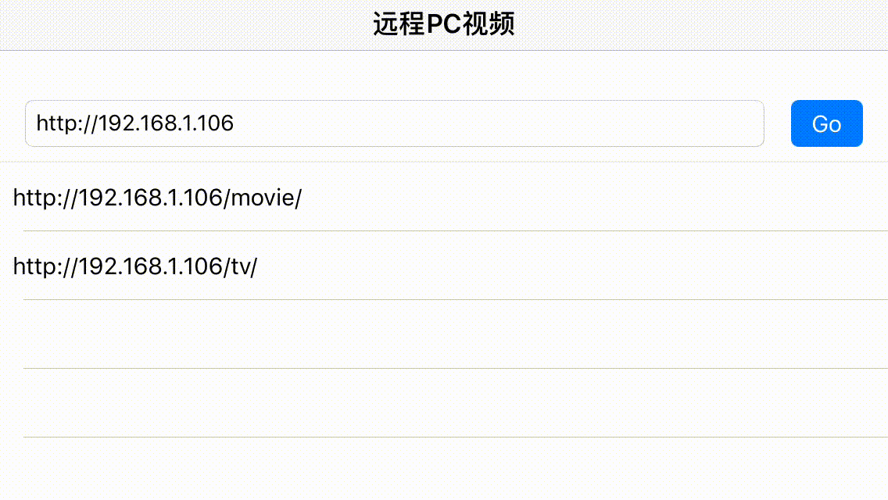
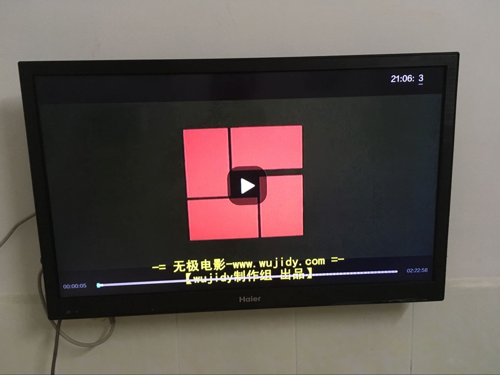

# iosplaypcvideodlna
ios播放本地服务器视频，dlna投射视频到盒子上
MobileVLCKit.framework因为太大（900mb）没有上传，请自行下载

```
支持视频格式mp4、avi、mkv、3gp、rmvb、wmv、mpg、flv、swf
```

# 一个基于VLC的播放器

```
本地搭建视频列表，访问pc视频，实现播放、DLNA|AirPlay，盒子播放
```

## 效果展示

###手机视频


###电视盒子


